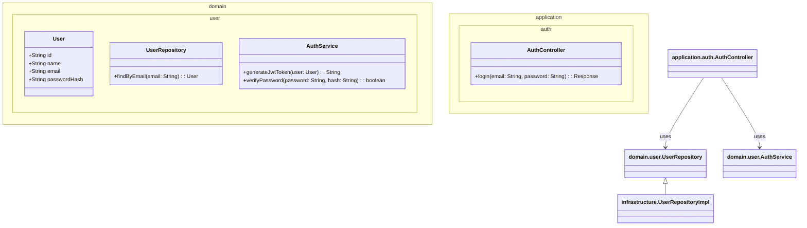
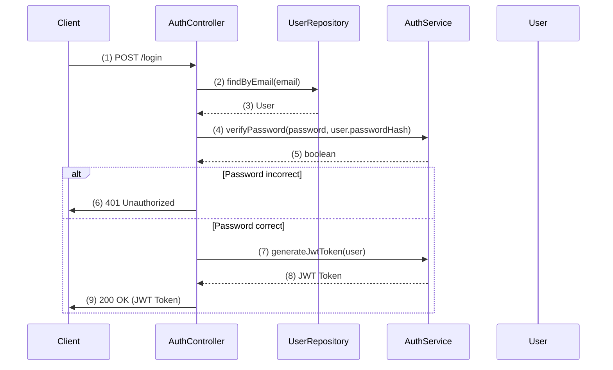

# DDDクラス図・シーケンス図

## クラス図（Mermaid）

```mermaid
classDiagram
namespace domain.user {
    class User {
        +String id
        +String name
        +String email
        +String passwordHash
    }
    class UserRepository {
        +findByEmail(email: String): User
    }
    class AuthService {
        +generateJwtToken(user: User): String
        +verifyPassword(password: String, hash: String): boolean
    }
}

namespace application.auth {
    class AuthController {
        +login(email: String, password: String): Response
    }
}

domain.user.UserRepository <|-- infrastructure.UserRepositoryImpl
application.auth.AuthController --> domain.user.UserRepository : uses
application.auth.AuthController --> domain.user.AuthService : uses
```

## シーケンス図（Mermaid）

```mermaid
sequenceDiagram
participant Client
participant AuthController
participant UserRepository
participant AuthService
participant User

Client ->> AuthController: (1) POST /login
AuthController ->> UserRepository: (2) findByEmail(email)
UserRepository -->> AuthController: (3) User
AuthController ->> AuthService: (4) verifyPassword(password, user.passwordHash)
AuthService -->> AuthController: (5) boolean
alt Password incorrect
    AuthController ->> Client: (6) 401 Unauthorized
else Password correct
    AuthController ->> AuthService: (7) generateJwtToken(user)
    AuthService -->> AuthController: (8) JWT Token
    AuthController ->> Client: (9) 200 OK (JWT Token)
end
```
